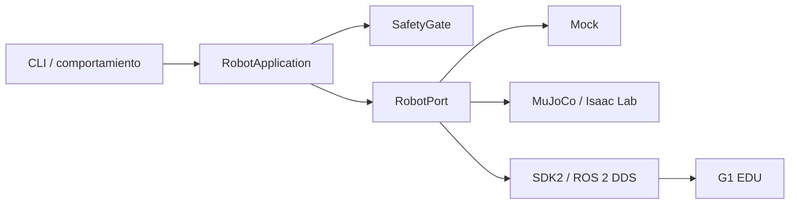

# Arquitectura

## Principios

1. **Simulación primero:** toda función nueva pasa por `mock` y luego MuJoCo/Isaac Lab.
2. **Fail closed:** variante desconocida, estado vencido, E-stop o límites excedidos bloquean movimiento.
3. **Puertos y adaptadores:** el dominio no importa SDK2, DDS ni ROS 2.
4. **Configuración explícita:** simulación y hardware usan dominios DDS e interfaces distintas.
5. **Observabilidad:** cada sesión real deberá registrar configuración, firmware, estado y comandos.

## Capas

- `domain.py`: tipos puros, independientes del transporte.
- `safety.py`: invariantes comprobables antes de emitir comandos.
- `application.py`: casos de uso y apagado seguro.
- `ports.py`: contrato del robot.
- `adapters/`: integración con mock, simulador o hardware.
- `cli.py`: herramienta operativa mínima y automatizable.

El siguiente hito implementa `SimulationRobot`; el adaptador `UnitreeRobot` se implementa después
de cerrar el perfil de hardware y probar la misma interfaz en simulación.

